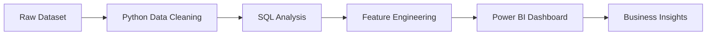

# 📊 Marketing Campaign & Customer Analysis Dashboard

### 📈 End-to-End Data Analytics Project

<p align="center">
  
  
  
</p>

---

## 🎯 Project Summary

This project demonstrates a complete **Marketing Campaign & Customer Analysis workflow**, where raw customer data is transformed into meaningful business insights using Python, SQL, and Power BI.

The dashboard helps analyze:
- Customer demographics
- Campaign performance
- Product sales contribution
- Purchase behavior
- Customer engagement patterns

It highlights my ability to:
- Perform data cleaning & preprocessing
- Write analytical SQL queries
- Create interactive Power BI dashboards
- Generate business insights through data visualization
- Build professional end-to-end analytics projects

---

## 🎨 Dashboard Preview

<p align="center">
  
</p>

---

## 🚀 Key Metrics

| Metric | Value |
|--------|--------|
| 👥 Total Customers | 2.2K+ |
| 💰 Total Spending | $1.35M |
| 📈 Average Income | $51.6K |
| 🛒 Average Web Purchases | 4.1 |
| 📢 Campaign Response Rate | 15% |

---

## 📊 Insights Snapshot

- 🍷 Wines contributed the highest share of total sales revenue
- 🏪 Store purchases were the most preferred purchase channel
- 💻 High-income customers showed higher web purchasing activity
- 📈 Final campaign achieved the highest success rate
- 🔥 Active customers generated the highest overall spending
- 👨‍👩‍👧 Middle-age customer groups formed the majority of customers

---

## 🔄 Workflow
## 🔄 Workflow



---

# 🛠️ Tech Stack

<p align="center">
  
  
</p>

---

# 📂 Repository Structure

```bash
├── data/
│   ├── cleaned_marketing_data.xlsx
│   └── data_dictionary.xlsx
│
├── notebooks/
│   └── marketing_analysis.ipynb
│
├── sql/
│   └── marketing_analysis.sql
│
├── dashboard/
│   └── marketing_dashboard.pbix
│
├── images/
│   └── dashboard.png
│
└── README.md
```

---

# 🧹 Data Cleaning Process

The dataset was cleaned and transformed using Python in Jupyter Notebook.

## Steps Performed:
- Removed missing/null values
- Standardized column names
- Corrected data types
- Created customer segments
- Performed feature engineering
- Prepared data for Power BI visualization

---

# 📊 Dashboard Features

## KPI Cards
- Total Customers
- Total Spending
- Average Income
- Average Web Purchases
- Campaign Response Rate

## Interactive Visuals
- Customer distribution by age group
- Product sales analysis
- Campaign success comparison
- Purchase channel analysis
- Customer recency segmentation
- Income vs web purchase trends

## Filters
- Education
- Country
- Income Group
- Marital Status
- Recency Group

---

# 🗃️ SQL Analysis

SQL queries were used to:
- Analyze customer spending patterns
- Calculate campaign response rates
- Segment customers
- Compare purchasing channels
- Generate aggregated business insights

---

# 📚 Key Learnings

✔️ Data cleaning and preprocessing

✔️ Writing analytical SQL queries

✔️ Interactive dashboard development

✔️ Business insight generation

✔️ Data storytelling with Power BI

✔️ End-to-end analytics workflow

---

# 🔮 Future Improvements

- Implement advanced DAX measures
- Add predictive analytics
- Create time-series trend analysis
- Improve dashboard interactivity
- Optimize mobile dashboard view

---

# 👩‍💻 Author

## Samiksha Pawar

Aspiring Data Analyst & Full-Stack Developer  
Currently pursuing SYBSc IT

---

# 🤝 Connect With Me

<p align="center">
  <a href="https://www.linkedin.com/in/samiksha-pawar-aa1018266">
    
  </a>
</p>

---

# ⭐ Support

If you like this project, consider giving it a ⭐ on GitHub!

---

<p align="center">
  <b>“Turning Data into Insights Through Visualization 📊”</b>
</p>
